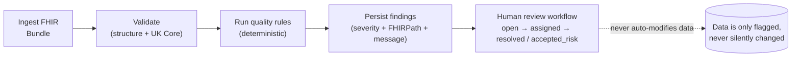

# Clerkstone - Safety Architecture

> How the architecture contributes to clinical safety. Companion documents:
> [Hazard_Log.md](./Hazard_Log.md) · [THREAT_MODEL.md](./THREAT_MODEL.md) · [DECISIONS.md](./DECISIONS.md)

## 1. Positioning

Clerkstone is a **portfolio prototype operating exclusively on synthetic data**. It is not
NHS-approved, not clinically validated, not a medical device, and must not be used for patient care.
The architecture nevertheless embodies the design principles a real clinical system would need, and
this document explains how each architectural choice *contributes to safety* - so that the
reasoning, not just the artefacts, is on show.

Four principles carry the safety argument:

1. **Human-in-the-loop** - the system never auto-modifies data; it flags and routes for review.
2. **Deterministic rules** - no learned model; same input ⇒ same output, provable in CI.
3. **Versioned rulesets** - every report states exactly which rules ran, so no false completeness.
4. **Synthetic-data framing** - defence in depth against the data ever being mistaken for real.

## 2. Human-in-the-loop

The safety model is **detect-and-route**, never **detect-and-correct**:

- A finding carries a `suggested_action` written from the rule's perspective, and a FHIRPath
  `expression` pointing at the exact element - so a reviewer is given a *location and a hypothesis*,
  not a verdict.
- `accepted_risk` is a first-class resolution state: a deliberate human override is recorded *with
  attribution*, rather than silently discarded.
- The review workflow is a **deterministic state machine** with allowed-transition tests
  (`open → assigned → resolved / accepted_risk`). There is no model deciding what a reviewer "should"
  do.

## 3. Deterministic rules (no ML)

Every task in Clerkstone is deterministic, and that is the safety requirement, not a limitation
(see [DECISIONS.md - ADR-002](./DECISIONS.md)):

- **Same input ⇒ same output.** A rule either fires or it does not, and its behaviour is pinned by
  its version and tests.
- **Testability.** Each of the 60+ rules has positive, negative and boundary tests, plus golden-file
  regression fixtures (40 curated defect bundles) that diff on any change.
- **Explainability.** A finding is a rule ID + severity + human message + FHIRPath - fully
  reconstructable, not a score.
- **Auditability.** The ruleset is versioned (`dq_ruleset.version`, semver) and the report always
  states which version ran.

If the optional NEWS2 early-warning-score feature is built, it is a **verbatim implementation of a
published national algorithm** (Royal College of Physicians), with cited worked examples and
traceable tests - a rules implementation, never a learned model. It sits on the deterministic side of
the MHRA SaMD boundary.

## 4. Versioned rulesets

The quality engine cannot imply completeness it does not have. Three mechanisms enforce this:

- `dq_ruleset` is a versioned entity (`2.1.0`) and `dq_run.ruleset_version` records which version
  produced a given run.
- The UI and API both surface "⟨N⟩ rules applied, ruleset v⟨X⟩" - completeness is never implied.
- The README states the honest limitation: *"The quality engine detects the defects I designed it to
  detect. It has no coverage guarantee against defects I did not anticipate - which is why the
  ruleset is versioned and the report always states which version ran."*

This is the architectural answer to the false-negative hazard (CLK-01): the system makes the *scope
of its assurance* explicit instead of claiming "clean data".

## 5. Synthetic-data framing (defence in depth)

Because every record is synthetic, the highest-value safety control is preventing anyone from
forgetting that. It is applied at five layers (hazard CLK-07):

| Layer | Mechanism |
|---|---|
| UI | Permanent "synthetic data / not for clinical use" banner on every view |
| API | `synthetic_data_notice` in every response body |
| Transport | `X-Clerkstone-Data-Class: synthetic` header on every response |
| Documentation | README scope statement + provenance statement in every repository |
| Naming | Repo and product names avoid clinical-trust language |

## 6. Supporting safety properties in the data layer

- **Immutable source of truth.** `fhir_resource` keyed on `(resource_type, logical_id, version_id)`
  means resources are versioned, never overwritten in place.
- **Tamper-evident audit.** The append-only, hash-chained `audit_event` proves *who read which
  patient when* and that the trail was not edited (CLK-05).
- **Identifier integrity.** NHS-number check-digit validation and duplicate detection (`IDENT-003`,
  `IDENT-005`) prevent mis-identification (CLK-03).
- **Explicit failure over silent pass.** The terminology resolver has a circuit-breaker with an
  explicit `unresolved` state - never a silent "treat as valid" (CLK-06).
- **Encoding correctness.** UTF-8 enforced at every boundary and `STRUCT-004` detects mojibake and
  combining-character anomalies (CLK-08).

## 7. What safety cannot be claimed

- No **Clinical Safety Case Report** exists - that requires a registered **CSO's** signature (stated
  plainly in [Hazard_Log.md](./Hazard_Log.md)).
- No **real data** flows through the system, so the *clinical* consequences column of the hazard log
  is hypothetical by design.
- The SNOMED CT / dm+d mapping is **illustrative and non-clinical**; UK Core is treated as a "work in
  progress, not for implementation".
