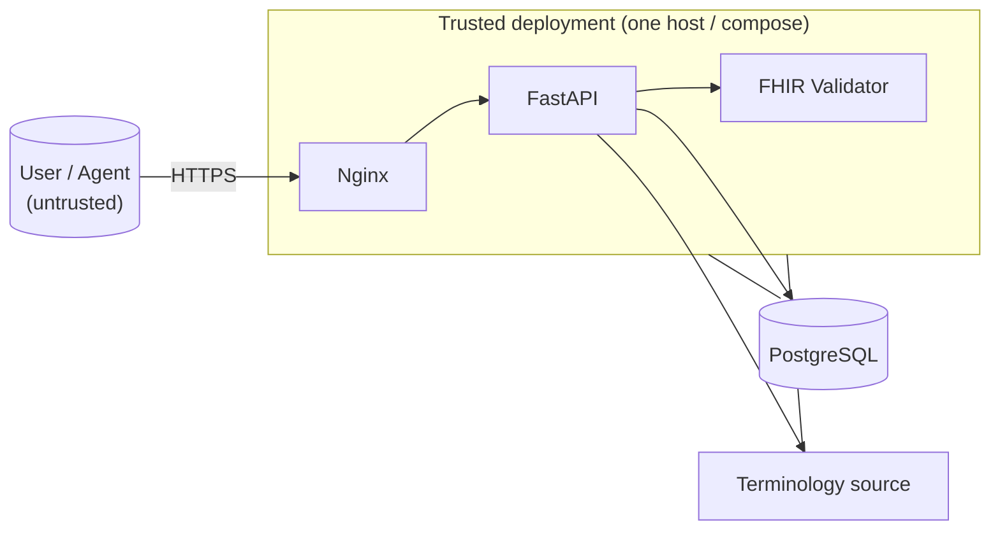

# Clerkstone - Threat Model (STRIDE)

> Applies Microsoft's STRIDE to each runtime component and maps mitigations to the controls in the
> specification §19. Companion documents: [Hazard_Log.md](./Hazard_Log.md) ·
> [Safety_Architecture.md](./Safety_Architecture.md).

## 0. Trust boundaries

**Boundaries that matter:** (1) the public internet → Nginx (the only internet-facing surface);
(2) the API → database (data at rest and integrity); (3) the API → validator sidecar; (4) the API →
external terminology server (outbound SSRF surface). The web, API and validator are stateless
containers in one trust domain; the database is the only stateful, high-value target.

---

## 1. Web (Next.js 15)

| STRIDE | Threat | Mitigation (→ §19 control) |
|---|---|---|
| **S**poofing | Attacker impersonates a logged-in user | JWT RS256 with validated `iss`/`aud`/`exp`; 15-min access tokens (→ *Authentication*) |
| **T**ampering | Stored XSS via rendered clinical data | React escapes by default; CSP via Nginx security headers; no `dangerouslySetInnerHTML` on untrusted fields (→ *Input validation*, *Docker hardening*) |
| **R**epudiation | User denies an action taken in the UI | Every read/write is server-side audited with actor + request ID; UI cannot bypass (→ *Audit logging*) |
| **I**nformation Disclosure | Leaking another patient's data in the browser | Data fetched server-to-server with the user's token; field-level RBAC scoping applied at the API, not the UI (→ *Authorisation / RBAC*) |
| **D**enial of Service | Malicious heavy renders / API fan-out | Server-side pagination with hard `_count` caps; Nginx rate limiting (→ *Input validation*, §20) |
| **E**levation of Privilege | Client-side role spoofing | Roles are **never** trusted from the client; they come from the verified JWT claims + `app_user` (→ *Authorisation / RBAC*) |

## 2. Nginx reverse proxy

| STRIDE | Threat | Mitigation (→ §19 control) |
|---|---|---|
| **S**poofing | Man-in-the-middle on the client connection | TLS termination (Let's Encrypt in prod, self-signed locally) (→ *Encryption*) |
| **T**ampering | Response tampering in transit | HTTPS end-to-end to the browser; security headers (`HSTS`, `X-Content-Type-Options`, `X-Frame-Options`) (→ *Encryption*) |
| **R**epudiation | Requests with no traceability | Request-ID injection (`X-Request-Id`) propagated to structured logs and the audit log (→ *Audit logging*, *Observability*) |
| **I**nformation Disclosure | Over-broad CORS, leaking origins | CORS allow-list (`CORS_ALLOW_ORIGINS`), never `*` (→ *Input validation*, §20 env) |
| **D**enial of Service | Request flood | Per-IP and per-route rate limiting (`RATE_LIMIT_PER_MINUTE`), timeouts, size caps (→ *Input validation*, §20) |
| **E**levation of Privilege | Bypassing app auth by hitting a backend directly | Backends bound to private networks; Nginx is the only public listener; deny-by-default (→ *Docker hardening*) |

## 3. FastAPI application

| STRIDE | Threat | Mitigation (→ §19 control) |
|---|---|---|
| **S**poofing | Forged / replayed JWT | RS256 signature verification; validated `iss`/`aud`/`exp`; short TTL; key rotation (→ *Authentication*) |
| **T**ampering | Malformed / oversized FHIR payload | Pydantic v2 strict models; FHIR structural + profile validation before persistence; size caps; JSON depth limits (→ *Input validation*) |
| **R**epudiation | Unlogged read/write | Append-only, hash-chained audit of **reads and writes** with actor, role, action, resource, outcome, request ID, hashed IP (→ *Audit logging*) |
| **I**nformation Disclosure | IDOR (patient A's token reads patient B) | Field-level RBAC scoping in one FastAPI dependency; exhaustive IDOR tests (→ *Authorisation / RBAC*) |
| **D**enial of Service | Expensive query / unbounded pages | `DB_STATEMENT_TIMEOUT_MS`, page-size maxima, indexed projections, batched rule execution (→ *Database design*, §12) |
| **E**levation of Privilege | Role confusion via a route without a guard | Single RBAC dependency, no ad-hoc checks; route×role matrix test in CI (→ *Authorisation / RBAC*, CLK-04) |

**Cross-cutting:** SQL injection is addressed by parameterised SQL only (a lint rule bans f-string
SQL); outbound SSRF is addressed by allow-listing the terminology base URL (never user-supplied).

## 4. PostgreSQL

| STRIDE | Threat | Mitigation (→ §19 control) |
|---|---|---|
| **S**poofing | Connecting as the wrong DB role | DB role separation; the app role has no `UPDATE`/`DELETE` on `audit_event` (→ *Audit logging*, CLK-05) |
| **T**ampering | Silent edit of stored records | Append-only audit + SHA-256 hash chain; `fhir_resource.security_hash` (SHA-256 of payload) for integrity (→ *Audit logging*) |
| **R**epudiation | "I never changed that row" | Hash chain makes tampering *detectable*, and `make verify-audit` proves position of any edit (→ *Audit logging*) |
| **I**nformation Disclosure | Over-fetched columns (postcode, IP) | Data minimisation: outward postcode only, salted-hashed IP, per-field justification (→ *Data minimisation / Caldicott*) |
| **D**enial of Service | Resource exhaustion | Connection pool limits (`DB_POOL_SIZE`), statement timeouts, managed Postgres in prod (→ §20) |
| **E**levation of Privilege | App role doing DDL | Separate migration role; app runs with least privilege; no superuser in runtime (→ *Docker hardening*) |

## 5. FHIR Validator sidecar

| STRIDE | Threat | Mitigation (→ §19 control) |
|---|---|---|
| **S**poofing | A rogue service posing as the validator | Only the API can reach it (private network); validator image pinned by digest (→ *Docker hardening*) |
| **T**ampering | A tampered validator that "passes" bad data | UK Core package version pinned (`UKCORE_PACKAGE_VERSION`); image scanned by Trivy (→ *Dependency & supply chain*) |
| **R**epudiation | Validation outcome unattributed | `$validate` result is returned to the caller as an `OperationOutcome` and recorded in the audit log (→ *Audit logging*) |
| **I**nformation Disclosure | Validator logs leaking resource content | Validator output scoped to `OperationOutcome`, not raw resources; no secrets in the image (→ *Docker hardening*) |
| **D**enial of Service | Validator down stalls ingestion | `/ready` checks validator reachability; request timeout (`VALIDATOR_TIMEOUT_SECONDS`); ingest reports partial status (→ *Observability*) |
| **E**levation of Privilege | Validator influencing write decisions | The validator is read-only w.r.t. storage - it only returns an `OperationOutcome`; writes are API-side (→ design) |

## 6. Terminology source

| STRIDE | Threat | Mitigation (→ §19 control) |
|---|---|---|
| **S**poofing | A fake terminology server answers lookups | Base URL allow-listed and pinned (`TERMINOLOGY_NHSE_BASE_URL`); TLS to the live server (→ *Input validation / SSRF*) |
| **T**ampering | Corrupted local cache | Local SQLite cache built from a licensed TRUD/dm+d subset; subset version recorded in every report (→ *Dependency & supply chain*, CLK-06) |
| **R**epudiation | "Which resolver ran?" | Run summary states resolver mode (`local-subset` vs `nhse-live`) and version (→ *Audit logging*, CLK-06) |
| **I**nformation Disclosure | Leaking API key | Key held in secret store only, never in env/ARG/layer; gitleaks + Trivy scan (→ *Secrets management*) |
| **D**enial of Service | Live server slow / down | Timeout, retry, circuit-breaker (`TERMINOLOGY_CIRCUIT_BREAKER_THRESHOLD`); explicit `unresolved`, never silent pass (→ CLK-06) |
| **E**levation of Privilege | N/A - read-only lookups | Adapter exposes only `$lookup`/`$expand`/`$validate-code`; no write path to the terminology source |

---

## 7. Controls → §19 mapping (summary)

| Threat family | Primary §19 control |
|---|---|
| Spoofing | *Authentication* (JWT RS256), *Docker hardening* |
| Tampering | *Audit logging* (hash chain), *Input validation*, *Dependency & supply chain* |
| Repudiation | *Audit logging* (append-only, reads + writes) |
| Information Disclosure | *Authorisation / RBAC* (field-level scoping), *Data minimisation / Caldicott*, *Encryption* |
| Denial of Service | *Input validation* (caps), *Observability* (readiness, timeouts), §20 rate limiting |
| Elevation of Privilege | *Authorisation / RBAC* (deny-by-default, single dependency) |

**Out of scope for the prototype:** a SIEM, a WAF, and managed-key infrastructure - these are named
as what a *real* Trust deployment would additionally require, not silently claimed as present.
