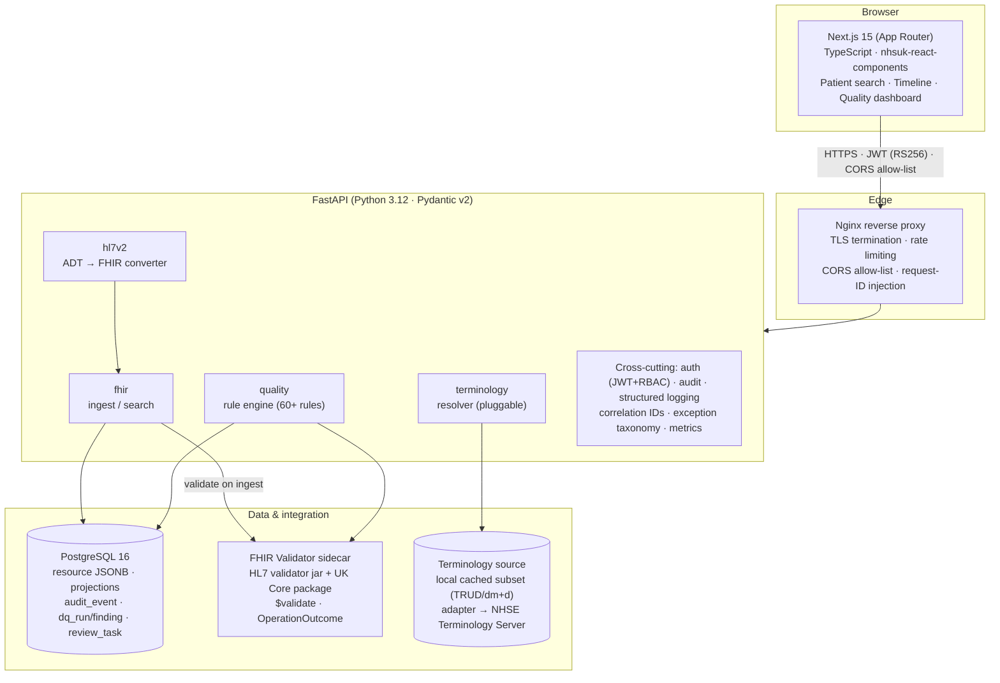
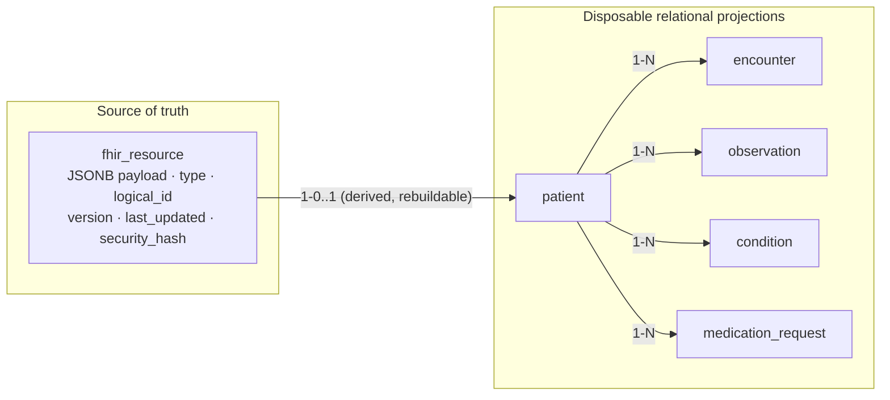
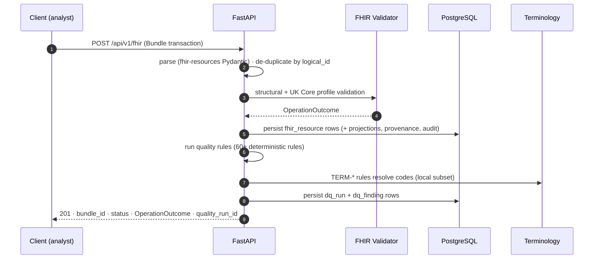
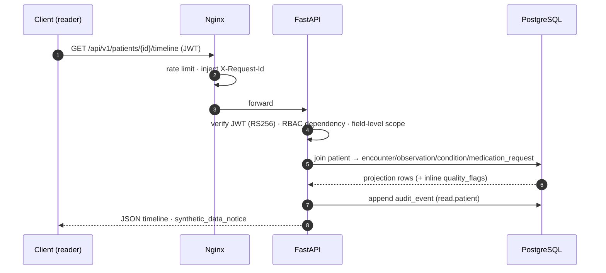
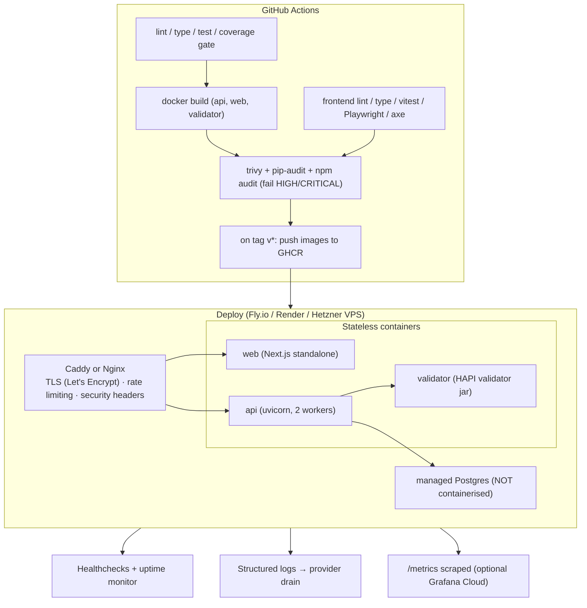

# Clerkstone - System Architecture

> Part of the Clerkstone governance/architecture documentation suite. Companion documents:
> [DECISIONS.md](./DECISIONS.md) · [THREAT_MODEL.md](./THREAT_MODEL.md) · [Safety_Architecture.md](./Safety_Architecture.md)

## 1. Overview

Clerkstone is a **modular monolith** that ingests synthetic FHIR R4 resources, validates them
against HL7 FHIR UK Core profiles, persists them in a **relational + JSONB hybrid** PostgreSQL
schema, runs a **deterministic data-quality rule engine**, and exposes a governed REST API plus a
React clinical timeline.

There are exactly six runtime components, deployed as five containers (the terminology source is a
library seam, not a service in the default build):

| # | Component | Responsibility | Container |
|---|-----------|----------------|-----------|
| 1 | **Next.js web** | Patient search, clinical timeline, quality dashboard, resource viewer | `web` |
| 2 | **Nginx reverse proxy** | TLS termination, rate limiting, CORS allow-list, request-ID injection, security headers | `nginx` |
| 3 | **FastAPI application** | FHIR ingest/search, quality rule engine, terminology resolver, HL7 v2 ADT→FHIR converter, auth/RBAC, audit, metrics | `api` |
| 4 | **PostgreSQL 16** | Source-of-truth JSONB store + relational projections + audit/quality/review tables | `db` |
| 5 | **FHIR validator sidecar** | Reference HL7 validator (jar) + UK Core package; `$validate` proxy | `validator` |
| 6 | **Terminology source** | Local cached TRUD/dm+d subset behind a pluggable adapter (`local` / `nhse` / `offline-stub`) | inside `api` |

## 2. Component diagram

## 3. The modular-monolith decision

Clerkstone is deployed as **one FastAPI process** (plus stateless sidecars), not as a fleet of
microservices. This is a deliberate engineering choice, not a lack of ambition:

- **The seams are inside the process.** `fhir`, `quality`, `terminology`, and `hl7v2` are separate
  domain modules with narrow interfaces (`TerminologyClient` protocol, `Rule` ABC, the bundle
  transaction layer). If the load ever justified a split, any module could be extracted behind its
  existing interface without a rewrite.
- **The workload is synchronous and small.** Ingestion of a bundle is a single request/response.
  There is no long-running queue work, so a message broker would be theatre.
- **Operational simplicity is a feature for a portfolio project.** One image, one healthcheck set,
  one database transaction boundary. Fake microservices would add deployment complexity with no
  scaling payoff at the 500-5,000-patient scale.
- **PostgreSQL is the only stateful service.** Everything else is stateless and horizontally
  scalable. The validator sidecar is isolated in its own container purely because it drags a JRE and
  the reference validator jar - a heavyweight dependency a Trust would isolate the same way.

The full reasoning is recorded in [DECISIONS.md - ADR-001](./DECISIONS.md).

## 4. "FHIR for fidelity; relational projections for query performance"

The single most important storage principle in Clerkstone:

> **FHIR for fidelity and exchange; relational projections for query performance. Projections are
> disposable and rebuildable; resources are not.**

The FHIR resource (JSONB) is the **source of truth** and the thing re-emitted on `$export`.
Relational tables are **derived projections** that exist only to make filtering, joining, sorting,
and aggregation fast. A projection must never be allowed to disagree with the resource: rebuilding
projections from resources is a supported, first-class operation (`make rebuild-projections`).

| What stays as a FHIR resource (JSONB) | What becomes a relational projection |
|---|---|
| The full resource - always | Anything filtered, joined, sorted or aggregated: identifiers, dates, codes, patient FK, status |
| Complex nested structures with no query value (`Patient.contact`, `Observation.component`, `Condition.stage`, extension trees) | Anything a quality rule needs fast access to |
| Provenance, `meta.security`, `meta.profile` | Anything the UI lists on a page (timeline entries) |
| Resource history / versions | Anything the audit log references |

The projection columns are chosen to serve three concrete consumers: the timeline query
(`idx_obs_patient_time`, `idx_enc_patient_start`), the quality engine's cohort/duplication rules
(`idx_obs_code`, `idx_patient_birth`), and the audit join (`patient.logical_id`).

## 5. Data flows

### 5.1 Ingest → validate → store → quality run

### 5.2 Clinical read path

## 6. Deployment topology

The **stateless / stateful split** is deliberate: containers for stateless apps, a **managed**
Postgres for state. Containerising the database in production is explicitly avoided - that
distinction is the kind of judgement an NHS engineering lead looks for (see
[RUNBOOK.md](./RUNBOOK.md)).

## 7. What is deliberately left out

- **No Kubernetes** - not evidenced by the target roles; docker compose is right-sized.
- **No message queue** - ingestion is synchronous and small.
- **No ML service** - every task is deterministic (see [DECISIONS.md - ADR-002](./DECISIONS.md)).
- **No separate microservice split** - a modular monolith is the correct architecture at this scale.
- **No Redis** - PostgreSQL handles the caching Clerkstone needs.
